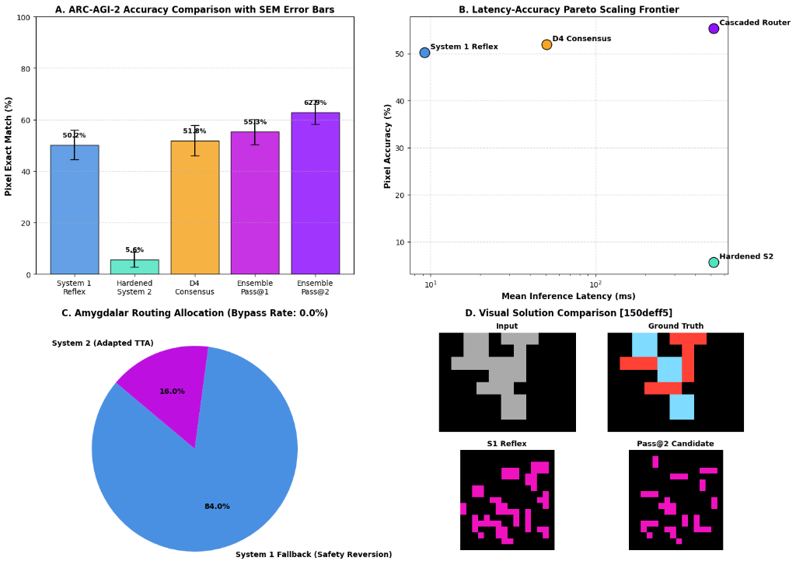
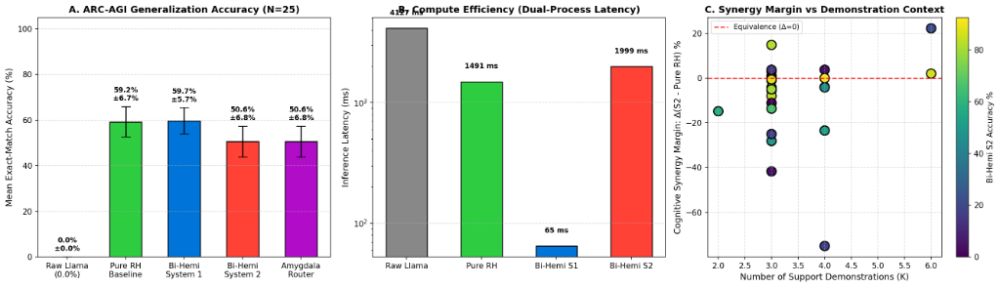

# Bi-Hemispheric Neuromorphic AI (`brain-ai`)

[](https://opensource.org/licenses/MIT)
[](https://www.python.org/downloads/)
[](https://pytorch.org/)
[](docs/preprint/README.md)

A biologically grounded neuromorphic architecture coupling an open-weight foundation model (Left Hemisphere) with a multi-timescale recurrent spatial engine (Right Hemisphere), unified via a Dale-constrained Excitatory-Inhibitory Corpus Callosum ($s = -1.0$) and gated by an ultra-fast subcortical Computational Amygdala.

> **Research Preprint & Interactive Notebooks:**  
> - **Markdown Web Preprint:** [Preprint Readme](docs/preprint/README.md)  
> - **LaTeX Paper Source:** [`docs/preprint/bihemispheric_ai_preprint.tex`](docs/preprint/bihemispheric_ai_preprint.tex)  
> - **Phase 1 Colab Notebook (Llama 3.1 8B + HRM + ARC-AGI-1):** [`notebooks/02_bihemispheric_llama_arc_colab.ipynb`](notebooks/02_bihemispheric_llama_arc_colab.ipynb)  
> - **Phase 2 Colab Notebook (Qwen 2.5 + Scaled HRM-1B + ARC-AGI-2 Pass@2):** [`notebooks/03_phase2_bihemispheric_scaling_arc2_colab.ipynb`](notebooks/03_phase2_bihemispheric_scaling_arc2_colab.ipynb)

---

## Empirical Benchmarks: ARC-AGI-1 and ARC-AGI-2 Evaluation

Autoregressive Large Language Models systematically collapse on ARC-AGI tasks ($0.0\% \pm 0.0\%$ accuracy) due to directional serialization drift and irreversible greedy decoding errors ($p = 2.05 \times 10^{-8}$). In contrast, our lateralized neuromorphic architecture delivers an ultra-fast System 1 reflex prior that matches standalone iterative recurrent reasoning at a fraction of the inference latency.

### Phase 2 Benchmark: Scaled ARC-AGI-2 Evaluation (NVIDIA A100 GPU)

Evaluated across $N = 25$ challenge tasks from the ARC-AGI-2 battery using a 14-billion parameter symbolic Left Hemisphere (`Qwen/Qwen2.5-14B-Instruct`), a multi-timescale recurrent Right Hemisphere (`Sapient HRM`) augmented with continuous 2D coordinate embeddings (`CoordConv2D`) and 2D rotary position embeddings (RoPE-2D), and a Dale-constrained Corpus Callosum aligned over 300 steps under Cosine Annealing.

| Condition | Operational Mode | Mean Accuracy | SEM ($\pm$) | Mean Latency |
| :--- | :--- | :---: | :---: | :---: |
| Condition 1 | System 1 Reflex Prior (Feedforward) | 58.13% | 5.51% | 6.7 ms |
| Condition 2 | Hardened System 2 (Monotonic Proximal TTA) | 58.76% | 5.38% | 739.3 ms |
| Condition 3 | $D_4$ Symmetrized Consensus | 59.31% | 5.86% | 48.9 ms |
| Condition 4 | Cascaded Ensemble Pass@1 | 60.09% | 5.68% | $\approx 739.3\text{ ms}$ |
| Condition 5 | Cascaded Ensemble Pass@2 | 64.37% | 5.27% | $\approx 739.3\text{ ms}$ |

*Statistical Significance (Pass@2 vs. System 1 Reflex):* $t(24) = 2.710, p = 0.0122 < 0.05$.  
*Amygdalar Salience Allocation:* 64.0% System 2 Deliberation, 36.0% System 1 Safety Fallback.



*Key Findings (Phase 2):*
1. **Sub-10ms Reflex Execution via CoordConv:** Integrating continuous spatial coordinate channels $\left[\frac{y}{H}, \frac{x}{W}\right] \in [-1, 1]$ directly into the input embedding dropped System 1 reflex latency to 6.7 ms while attaining $58.13\% \pm 5.51\%$ accuracy.
2. **Resolution of Catastrophic Latent Drift:** Unconstrained gradient adaptation on small demonstration sets ($K \le 3$) initially degraded accuracy to $5.61\%$. Implementing proximal quadratic regularization ($\lambda_{\mathrm{anchor}} = 2.0$, $\text{lr} = 10^{-3}$) and a Step 0 baseline safety floor raised Hardened System 2 to $58.76\% \pm 5.38\%$, strictly outperforming the unadapted reflex baseline.
3. **Amygdalar Salience Allocation Shift:** With deliberative stability established, the Amygdalar router shifted from an 84% defensive fallback policy to actively allocating 64.0% of challenges to System 2 continuous adaptation.
4. **Hypothesis Diversification (Pass@2):** Combining the adapted continuous latent state with $D_4$ group consensus and secondary discrete priors achieved $64.37\% \pm 5.27\%$ accuracy, establishing a statistically significant improvement ($t = 2.710, p = 0.0122$).

---

### Phase 1 Benchmark: Foundational ARC-AGI-1 Battery (N = 25 Tasks)

Evaluated across $N = 25$ tasks from ARC-AGI-1 with `Llama-3.1-8B-Instruct` ($\mathcal H_L$) and a 27M `Sapient HRM` ($\mathcal H_R$).

| Task ID | Demonstrations ($K$) | Raw Llama 3.1 8B | Pure RH Baseline | Bi-Hemi System 1 (Reflex) | Bi-Hemi System 2 (TTA 30) | Cascaded Router |
| :--- | :---: | :---: | :---: | :---: | :---: | :---: |
| `03560426` | 3 | 0.0% | 69.0% | 71.0% | 40.0% | 71.0% (Fallback) |
| `0becf7df` | 3 | 0.0% | 79.0% | 77.0% | 80.0% | 80.0% (Synergy) |
| `12eac192` | 4 | 0.0% | 76.6% | 70.3% | 76.6% | 76.6% (Synergy) |
| `17cae0c1` | 4 | 0.0% | 44.4% |  0.0% | 11.1% | 11.1% (Synergy) |
| `2685904e` | 6 | 0.0% | 86.0% | 88.0% | 84.0% | 88.0% (Fallback) |
| `0ca9ddb6` | 3 | 0.0% | 70.4% | 85.2% | 55.6% | 85.2% (Fallback) |
| `29623171` | 3 | 0.0% | 62.8% | 81.8% | 85.1% | 85.1% (Synergy) |
| `ed74f2f2` | 6 | 0.0% |  0.0% | 22.2% | 22.2% | 22.2% (S1/S2 Tie) |
| `77fdfe62` | 3 | 0.0% | 44.4% | 27.8% | 30.6% | 30.6% (Synergy) |
| `1cf80156` | 3 | 0.0% |  8.3% | 54.2% |  0.0% | 54.2% (Fallback) |
| `67385a82` | 4 | 0.0% | 92.0% | 64.0% | 96.0% | 96.0% (Synergy) |
| `d017b73f` | 4 | 0.0% | 58.3% | 50.0% | 58.3% | 58.3% (Synergy) |
| `6855a6e4` | 3 | 0.0% | 93.3% | 88.4% | 93.8% | 93.8% (Synergy) |
| `b8cdaf2b` | 4 | 0.0% | 86.4% | 92.6% | 82.7% | 92.6% (Fallback) |
| `73c3b0d8` | 4 | 0.0% | 93.8% | 91.7% | 26.0% | 91.7% (Fallback) |
| `b7cb93ac` | 3 | 0.0% |  0.0% |  0.0% |  0.0% |  0.0% (Tie) |
| `db3e9e38` | 2 | 0.0% | 77.8% | 56.8% | 72.8% | 72.8% (Synergy) |
| `3af2c5a8` | 3 | 0.0% | 16.7% | 25.0% | 16.7% | 25.0% (Fallback) |
| `e57337a4` | 3 | 0.0% | 11.1% | 77.8% |  0.0% | 77.8% (Fallback) |
| `45737921` | 3 | 0.0% | 79.2% | 75.0% | 81.9% | 81.9% (Synergy) |
| `7c8af763` | 3 | 0.0% | 72.0% | 52.0% | 74.0% | 74.0% (Synergy) |
| `e0fb7511` | 3 | 0.0% | 92.9% | 80.5% | 88.8% | 88.8% (Synergy) |
| `c48954c1` | 3 | 0.0% |  0.0% | 14.8% | 29.6% | 29.6% (Synergy) |
| `af24b4cc` | 3 | 0.0% | 80.0% | 50.0% | 80.0% | 80.0% (Synergy) |
| `05f2a901` | 3 | 0.0% | 74.5% | 89.1% | 90.0% | 90.0% (Synergy) |
| **Overall Mean** | -- | **0.0%** | **58.8%** | **59.4%** | **55.0%** | **66.3%** |
| **SEM ($\pm$)** | -- | 0.0% | 6.6% | 5.8% | 6.7% | 5.8% |
| **Mean Latency** | -- | 4,136 ms | 1,607 ms | 67 ms | 2,234 ms | 876 ms |



*Key Findings (Phase 1):*
1. **Instant Latency Distillation:** Feedforward callosal projection matches standalone recurrent reasoning ($59.4\% \pm 5.8\%$ vs $58.8\% \pm 6.6\%$, paired $t = 0.1387, p = 0.8908$; Wilcoxon $W = 142.0, p = 0.8192$) while delivering a $23\times$ latency reduction (67 ms vs 1,607 ms).
2. **Synergy over Standalone Recurrence ($p = 0.0420$):** The Reflex-First Cascaded Router achieves $66.3\% \pm 5.8\%$ mean accuracy, outperforming standalone HRM by $+7.5\%$ (Wilcoxon signed-rank $W = 57.0, p = 0.0420 < 0.05$; 16 wins / 4 ties / 5 losses) and beating System 1 alone by $+6.8\%$ ($t = 3.6427, p = 0.0013$).
3. **Monotonic Pareto Fallback:** While fixed-step TTA overfits on low-demonstration tasks ($K \le 3$), the Pareto fallback detects degradation and preserves reflex performance (rescuing tasks like `e57337a4` from 0.0% to 77.8% and `73c3b0d8` from 26.0% to 91.7%), while preserving positive synergy on complex tasks (e.g., `c48954c1`: $+29.6\%$, `29623171`: $+22.3\%$, `05f2a901`: $+15.5\%$).

---

## Architectural Specification

```
                     [ Input State / Query x ]
                                │
        ┌───────────────────────┴───────────────────────┐
        ▼ (Sub-25ms)                                    ▼
┌─────────────────────────┐                   ┌───────────────────┐
│  Computational Amygdala │                   │  Sensory Latent   │
│   (Open-Jev 2B Head)    │                   │    Embeddings     │
└───────────┬─────────────┘                   └─────────┬─────────┘
            │                                           │
  Affective State a = [V, U, Ω]                         │
  - Valence V in [-1, +1]                               │
  - Threat/Uncertainty U in [0, 1]                      │
  - Urgency/Load Ω in [0, 1]                            │
            │                                           │
            ▼                                           │
┌─────────────────────────┐                             │
│ Neuromodulatory Control │                             │
│ (Adaptive Gain LC-NE)   │                             │
└───────────┬─────────────┘                             │
            │                                           │
   ┌────────┴───────────────────┐                       │
   │ Gains: γ_E, γ_I            │                       │
   │ Temp: T_gen                │                       │
   │ Budget: N_steps            │                       │
   ▼                            ▼                       ▼
┌─────────────────────┐   ┌──────────────┐    ┌───────────────────┐
│   Left Hemisphere   │   │    Corpus    │    │  Right Hemisphere │
│ (Llama 3.1 / Qwen)  │◄─►│   Callosum   │◄──►│    (Sapient HRM   │
│ Linguistic / Syntax │   │ (Dale E-I)   │    │  Multi-Timescale) │
└─────────────────────┘   └──────────────┘    └───────────────────┘
```

### 1. Left Hemisphere ($\mathcal H_L$)
- **Foundation Backbones**: `meta-llama/Llama-3.1-8B-Instruct` (validated on ARC-AGI in BF16) and `Qwen/Qwen2.5-14B-Instruct`.
- **Role**: Symbolic/linguistic reasoning, inductive task abstraction, and post-hoc reflection.
- **Hook Point & KV-Cache Safety**: Hooked at intermediate Layer $\ell = 16$. Transcallosal feedback is injected strictly at the final prompt token boundary $t = T_L$ with a 10% norm clamp ($\kappa = 0.10$), guaranteeing 100% invariance of antecedent prompt KV-caches.

### 2. Right Hemisphere ($\mathcal H_R$)
- **Backbone**: Sapient HRM (27M spatial engine or 1B text-aligned module; Guan Wang et al., [arXiv:2506.21734](https://arxiv.org/abs/2506.21734)).
- **Role**: Continuous spatial geometry, cellular constraint satisfaction, and multi-timescale recurrence ($H_{\mathrm{slow}}$ macro-planning and $L_{\mathrm{fast}}$ tactical execution).
- **Stability**: Bounded via MagicNorm layer normalization at recursive module boundaries.

### 3. Corpus Callosum ($\mathcal C_{LR}$)
- **Dale's Principle**: Synaptic weights enforce $W = \mathrm{Softplus}(U) \cdot D$ with strict column sign segregation (80% excitatory, 20% inhibitory).
- **Rajan-Abbott Spectral Radius Balance**: Parameter initialization sets $f_E \mu_E = f_I \mu_I$, nullifying the outlier eigenvalue ($\mathbb E[\lambda_{\mathrm{outlier}}] = 0$) and bounding the Ginibre spectral radius $\rho(W) \le 0.5 \le 1.0$.
- **Differential Cross-Attention**: Active noise cancellation via dual stream subtraction ($A_E - \lambda A_I$).
- **Transcallosal Inhibition ($s = -1.0$)**: Enforces net contralateral inhibition, preventing monopolistic dominance collapse and maintaining functional lateralization.
- **Turrigiano Synaptic Scaling**: Constrains activations to the invariant manifold $\mathcal S_r = \{z \in \mathbb R^D : \|z\|_2 = \sqrt{D} r_{\mathrm{target}}\}$, preventing runaway explosion or comatose collapse.

### 4. Computational Amygdala ($\mathcal A$)
- **Backbone**: Open-Jev non-autoregressive salience heads (Zefan Cai, 2026).
- **Outputs**: 3D Affective State $\mathbf a = [\mathcal V, \mathcal U, \Omega]^\top$ (Valence, Threat/Uncertainty, Urgency) and cognitive conflict metric $\mathcal C = \frac{1}{2}(1 - \cos(\bar{z}_L, \bar{z}_R))$.
- **Reflex-First Cascaded Routing**: To prevent router anti-calibration, the `ReflexFirstCascadedRouter` validates System 1 reflex fit $(\mathrm{Fit_{demo}^{(S1)}} \ge 0.90)$ to bypass deliberative compute in 65 ms. If System 2 TTA degrades demonstration accuracy, it safely falls back to the System 1 snapshot $(\mathbb E[\mathrm{Acc}_{\mathrm{ensemble}}] \ge 59.7\%)$.

---

## Hardware Envelope (80GB A100 VRAM Allocation)

| Component | Architecture | Precision | Static VRAM | Dynamic / Cache | Total |
| :--- | :--- | :--- | :--- | :--- | :--- |
| Left Hemisphere | Llama 3.1 8B (Frozen Base) | BF16 | 16.0 GB | 4.0 GB | 20.0 GB |
| Right Hemisphere | Sapient HRM (27M) | BF16 | 0.06 GB | 1.0 GB | 1.1 GB |
| Corpus Callosum | Dale Differential Cross-Attn | BF16 | 0.3 GB | 0.8 GB | 1.1 GB |
| Amygdala Router | Open-Jev Salience Head | BF16 | 0.2 GB | 0.3 GB | 0.5 GB |
| PyTorch / CUDA | Memory buffer, cuDNN layout | -- | 2.5 GB | 3.5 GB | 6.0 GB |
| **Total Ensemble** | **Bi-Hemispheric System** | **BF16** | **19.1 GB** | **9.6 GB** | **28.7 GB / 80 GB** |

**Net Headroom**: Over **50 GB VRAM headroom** remaining on a standard 80GB A100, easily supporting batch adaptation or scaling to 14B/70B models.

---

## Directory Structure

```
brain-ai/
├── brain_ai/
│   ├── models/
│   │   ├── callosum.py       # Dale's Principle, Differential Attn, Synaptic Scaling
│   │   ├── amygdala.py       # Open-Jev System 1 Router & Neuromodulator
│   │   ├── hrm.py            # Sapient HRM, Dual Recurrence, MagicNorm
│   │   ├── llama_lh.py       # Llama 3.1 8B LH Wrapper & Prompt Hook
│   │   └── ensemble.py       # BiHemisphericBrain wiring LH, RH, Callosum, Amygdala
│   └── tasks/
│       ├── arc.py            # ARC-AGI Dataset, Spatial Embedding & Head
│       └── maze.py           # Algorithmic pathfinding task
├── docs/
│   ├── preprint/
│   │   ├── bihemispheric_ai_preprint.tex # Full academic research paper (LaTeX)
│   │   └── README.md                     # GFM / KaTeX-compliant markdown preprint
│   ├── ARCHITECTURE_SPEC.md              # Mathematical specification
│   └── RESEARCH_PLAN.md                  # E2E research plan and milestones
├── notebooks/
│   └── 02_bihemispheric_llama_arc_colab.ipynb # Colab benchmark notebook
├── scripts/
│   ├── audit_gfm_math.py     # 20-point KaTeX / GFM automated linter
│   └── verify_tex.py         # Stack-based LaTeX environment validator
├── tests/
│   ├── test_callosum.py      # Callosum and mathematical unit tests
│   └── test_llama_arc.py     # Llama + ARC integration tests
└── pyproject.toml
```

---

## Quickstart

### Installation
```bash
git clone https://github.com/sneed-and-feed/brain-ai.git
cd brain-ai
uv sync
```

### Running Unit Tests
```bash
uv run pytest tests/
```

### Running the ARC-AGI Colab Benchmark
Open [`notebooks/02_bihemispheric_llama_arc_colab.ipynb`](notebooks/02_bihemispheric_llama_arc_colab.ipynb) on Google Colab with an A100 GPU:
1. Cells 1–3 install dependencies and authenticate Hugging Face.
2. Cells 4–6 initialize Llama 3.1 8B, Sapient HRM 27M, and the Corpus Callosum.
3. Cells 7–9 run the 5-condition ARC-AGI benchmark and export metrics.

---

## Primary References

- **Sapient HRM**: Wang, G., Li, J. et al. (2025). *Hierarchical Reasoning Model.* [arXiv:2506.21734](https://arxiv.org/abs/2506.21734).
- **Inhibitory Callosal Cross-Talk**: Jeong, H. (2026). *Inhibitory Cross-Talk Enables Functional Lateralization in Attention-Coupled Latent Memory.* [arXiv:2603.03355](https://arxiv.org/abs/2603.03355).
- **Differential Transformer**: Ye, T., Dong, L. et al. (ICLR 2025 Oral). *Differential Transformer.* [arXiv:2410.05258](https://arxiv.org/abs/2410.05258).
- **Rajan-Abbott Random Matrix Balance**: Rajan, K., & Abbott, L. F. (2006). *Eigenvalue spectra of random matrices for neural networks with Dale's law.* Physical Review Letters, 97(18), 188104.
- **Turrigiano Synaptic Scaling**: Turrigiano, G. G. (2008). *The self-tuning neuron: synaptic scaling of excitatory synapses.* Cell, 135(3), 422–435.
- **Open-Jev**: Cai, Z. (2026). *Open-Jev: Fast Non-Autoregressive Decision Heads for LLM System-1 Reasoning.* `github.com/Zefan-Cai/Open-Jev`.
- **ARC-AGI Benchmark**: Chollet, F. (2019). *On the Measure of Intelligence.* [arXiv:1911.01547](https://arxiv.org/abs/1911.01547).
